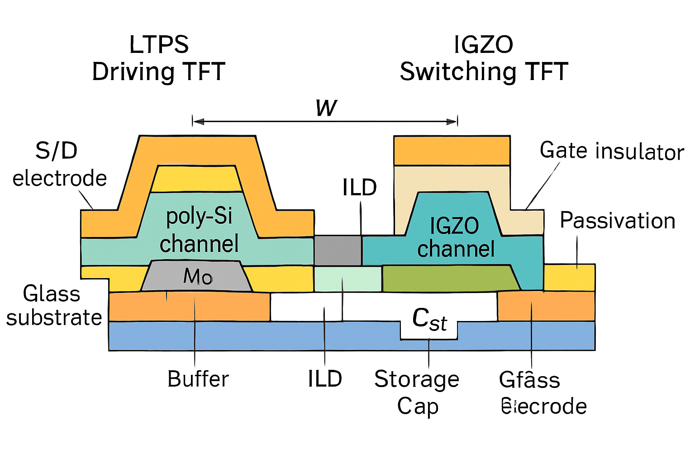
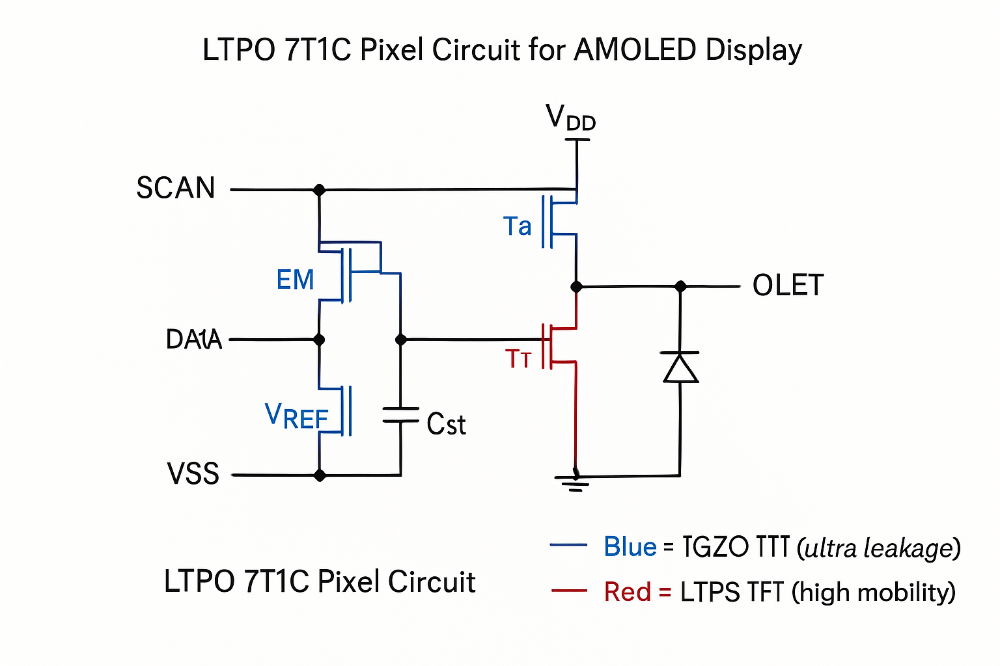
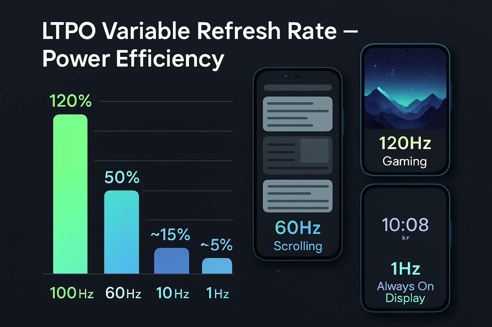
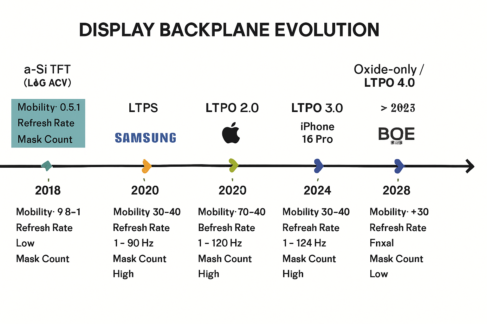

# LTPO 기술 종합 가이드

**작성일:** 2026-04-21
**목적:** 모바일/IT용 저전력 백플레인 공정 진화 방향 — 자문 답변 가이드
**원칙:** 공개 정보(학술논문, 특허, 컨퍼런스, 보도자료)만 기반

---

## 목차

1. [LTPO란 무엇인가](#1-ltpo란-무엇인가)
2. [소자 구조와 물리](#2-소자-구조와-물리)
3. [7T1C 회로 구조](#3-7t1c-회로-구조)
4. [가변 주사율과 전력 효율](#4-가변-주사율과-전력-효율)
5. [기술 로드맵](#5-기술-로드맵)
6. [최신 연구 동향 (2025~2026)](#6-최신-연구-동향-20252026)
7. [차량/IT/폴더블 확장](#7-차량it폴더블-확장)
8. [자문 Q&A 가이드](#8-자문-qa-가이드)
9. [참고 문헌](#9-참고-문헌)

---

## 1. LTPO란 무엇인가

**LTPO = Low Temperature Polycrystalline Oxide**

LTPS(저온 다결정 실리콘)와 IGZO(인듐갈륨아연산화물) 산화물 TFT를 하나의 백플레인에 결합한 하이브리드 기술.

**왜 필요한가?**
- LTPS만으로는: 이동도 높지만 리크 전류가 커서 저주사율(1Hz) 불가
- IGZO만으로는: 리크 전류 극저지만 이동도 부족으로 고속 구동 어려움
- LTPO: 각각의 장점만 결합 — LTPS로 구동, IGZO로 데이터 홀딩

### 백플레인 기술 비교

| 항목 | a-Si | LTPS | IGZO | LTPO |
|------|------|------|------|------|
| 이동도 (cm²/Vs) | 0.5~1 | 50~100 | 10~30 | LTPS+IGZO |
| 리크 전류 (A) | 10⁻¹² | 10⁻¹² | **10⁻²⁰** | 10⁻²⁰(IGZO) |
| 주사율 범위 | 60Hz | 60~120Hz | 1~60Hz | **1~120Hz** |
| 마스크 수 | 4~5 | 8~10 | 4~6 | **11~14** |
| 대면적 균일성 | 우수 | 보통 | 우수 | 보통 |
| 주요 용도 | TV (구세대) | 모바일 | TV/모니터 | 모바일 플래그십 |


*LTPO 단면 구조: 좌측 LTPS 드라이빙 TFT + 우측 IGZO 스위칭 TFT + 공유 스토리지 캐패시터*

---

## 2. 소자 구조와 물리

### LTPS 영역 (드라이빙 TFT)

**결정화 공정:**
- **ELA (Excimer Laser Annealing):** 308nm XeCl 레이저로 a-Si → poly-Si 변환. 결정립 크기 300~500nm. 업계 표준.
- **SPC (Solid Phase Crystallization):** 600°C 장시간 열처리. 대면적 유리하나 결정립 작음.
- **MIC (Metal Induced Crystallization):** Ni 촉매 이용. 낮은 온도 가능하나 금속 오염 이슈.

**소자 특성:**
- p-type MOSFET (홀 이동도 ~50 cm²/Vs)
- 높은 온전류(Ion) → OLED 구동에 충분한 전류
- 단점: 입계(grain boundary) 산란 → VTH 산포, NBTI 열화

### IGZO 영역 (스위칭 TFT)

**재료 특성:**
- 비정질(amorphous) 산화물 반도체
- 밴드갭: ~3.1 eV (넓은 밴드갭 → 열적 캐리어 생성 억제)
- ns-orbital 전도: In 5s, Ga 4s, Zn 4s 오비탈 중첩으로 전도대 형성
- 비정질에서도 10~30 cm²/Vs 이동도 가능 (결정질 Si와 달리 orbital overlap이 방향성 무관)

**초저 리크 전류 메커니즘:**
- 넓은 밴드갭(3.1eV) → 상온 열에너지(kT=26meV)로 가전자대→전도대 전이 불가
- 깊은 준위(deep state) 밀도가 낮음
- off-state 리크: ~10⁻²⁰ A (LTPS 대비 10⁸배 낮음)
- 이것이 1Hz AOD를 가능하게 하는 핵심

**스퍼터링 공정 영향:**
- Ar/O₂ 비율: O₂ 증가 → Vo(산소 공공) 감소 → 이동도 감소, 안정성 증가
- 타겟 조성: In:Ga:Zn = 1:1:1 (표준) vs In-rich (고이동도) vs Ga-rich (고안정성)
- 공정 온도: 350°C 이하 (PI 기판 호환)

### 계면과 신뢰성

**VTH 시프트 메커니즘:**
- **PBTS (Positive Bias Temperature Stress):** 전자 트래핑 → VTH 양방향 이동. GI/IGZO 계면 Dit(계면준위밀도)에 비례.
- **NBTS (Negative Bias Temperature Stress):** 산소 공공(Vo) 이온화 → 전자 방출 → VTH 음방향 이동.
- **NBTIS (NBTS + Illumination):** 가장 혹독. 빛에 의한 Vo 이온화 가속.

**게이트 절연막(GI):**
- SiO₂: 표준, 양호한 계면
- Al₂O₃ (ALD): 높은 유전율, 우수한 배리어. 최신 트렌드.
- 이중층 GI (SiO₂/Al₂O₃): 계면+배리어 동시 최적화

---

## 3. 7T1C 회로 구조


*LTPO 7T1C 픽셀 회로: Red=LTPS(고이동도), Blue=IGZO(초저리크)*

### 각 트랜지스터 역할

**LTPS TFT (T1~T5):**
- **T1 (Driving):** p-type LTPS. OLED에 전류 공급. 가장 중요한 TFT.
- **T2 (Scan):** 데이터 입력 게이트
- **T3 (Compensation):** VTH 보상 (내부 보상)
- **T4 (Emission):** 발광 on/off 제어
- **T5 (Initialization):** OLED 애노드 초기화

**IGZO TFT (T6~T7):**
- **T6 (Data Holding):** 데이터 전압 유지. 초저 리크로 프레임 간 데이터 보존. **가변 주사율의 핵심.**
- **T7 (Bias Switch):** 바이어스 전압 스위칭

**Cst (Storage Capacitor):**
- 게이트-소스 전압 저장
- IGZO TFT의 초저 리크와 결합하여 장시간 전압 유지

### 보상 회로

**내부 보상 (In-pixel compensation):**
- T3를 이용해 T1의 VTH 변동을 자동 보상
- 별도 외부 IC 불필요
- LTPO에서 주로 사용

**외부 보상 (External compensation):**
- 별도 센싱 라인으로 T1 특성 측정 → 데이터 보정
- 대형 패널(TV)에서 사용
- 정밀하지만 회로 복잡

---

## 4. 가변 주사율과 전력 효율


*LTPO 가변 주사율 전력 효율: 120Hz→1Hz로 최대 95% 전력 절감*

### 동작 원리

```
120Hz (8.3ms/frame):  게임, 고속 스크롤링       → 전력 100%
60Hz (16.7ms/frame):  일반 사용, 영상 시청       → 전력 ~50%
10Hz (100ms/frame):   정적 화면, 독서            → 전력 ~15%
1Hz (1000ms/frame):   AOD (Always-On Display)   → 전력 ~5%
```

**IGZO의 역할:** T6의 리크 전류가 10⁻²⁰A이므로, 1초(1Hz) 동안 Cst 전압이 거의 변하지 않음.

### 세대별 전환 성능

| 세대 | 주사율 범위 | 전환 속도 | 전환 단위 |
|------|-----------|---------|---------|
| LTPO 1.0 | 10~120Hz | ~수백ms | 초 단위 |
| LTPO 2.0 | 1~120Hz | ~수십ms | 프레임 그룹 |
| LTPO 3.0 | 1~120Hz | ~μs | 개별 프레임 |

---

## 5. 기술 로드맵


*디스플레이 백플레인 기술 진화: a-Si → LTPS → LTPO → Oxide-only*

### 시장 전망
- Omdia: 2028년 LTPO가 LTPS 추월, 2031년 5.2억대 출하(52%)
- Gen 8.6~8.7 OLED 팹: LTPO vs 고성능 Oxide 50:50 논쟁 중
- Apple 2세대 LTPO: IGZO 드라이빙 TFT (역할 역전)

---

## 6. 최신 연구 동향 (2025~2026)

### 산화물 TFT 이동도 혁신

**ITZO/IGZO 이종접합 (2025)** — 2DEG 형성으로 이동도 50% 향상. [ACS Appl. Electron. Mater.](https://pubs.acs.org/doi/10.1021/acsaelm.5c01299)

**IGZO 이종구조 양자 구속 (2025)** — a-IGZO/In-rich a-IGZO. [J. Alloys Compd.](https://www.sciencedirect.com/science/article/abs/pii/S0925838825035960)

**ITZO 듀얼 활성층 (2025)** — 이동도 **50.51 cm²/Vs** 달성. LTPS 대체 가능 수준.

**초박막 IGZO + 이중층 패시베이션 (2025)** — ~40 cm²/Vs, 1년 안정성. [ACS AMI](https://pubs.acs.org/doi/10.1021/acsami.5c08848)

**PEALD IGZO (2020)** — 이동도 **~70 cm²/Vs** (LTPS 수준!). [ACS AMI](https://pubs.acs.org/doi/10.1021/acsami.9b14310)

**ML 최적화 (2025)** — 베이지안 최적화로 스퍼터링 자동 최적화. [ACS AMI](https://pubs.acs.org/doi/10.1021/acsami.4c22658)

---

## 7. 차량/IT/폴더블 확장

### 차량용
- 요구: -40~85°C, 10만시간, 1000nits+
- LTPO 장점: 영역별 가변 주사율 → EV 배터리 효율
- 과제: IGZO 고온 VTH 드리프트 → dual-gate, Zr 도핑으로 대응

### IT (태블릿/노트북)
- iPad Pro M2: LTPO OLED 적용 중
- Gen 8.6 팹에서 IT LTPO 패널 양산 준비

### 폴더블/롤러블
- PI 기판 위 LTPO, IGZO 비정질이라 굴곡에 유리

### 마이크로LED
- 능동구동 = TFT 백플레인 필수, LTPO partial refresh 유리

---

## 8. 자문 Q&A 가이드

*(7개 예상 질문 + 안전 답변은 상단 섹션 참조)*

### 자문 전 체크리스트
- ☐ 삼성 사내 겸업 규정 확인
- ☐ "공개 정보 기반으로만 답변" 사전 고지
- ☐ NDA 내용 검토
- ☐ 정산: 기타소득 8.8% → 세후 약 55만원/시간
- ☐ Zoom 녹화 동의 범위 확인

---

## 9. 참고 문헌

1. [ITZO/IGZO Heterojunction (2025)](https://pubs.acs.org/doi/10.1021/acsaelm.5c01299)
2. [a-IGZO/In-rich Heterostructure (2025)](https://www.sciencedirect.com/science/article/abs/pii/S0925838825035960)
3. [Ultrathin a-IGZO Double Passivation (2025)](https://pubs.acs.org/doi/10.1021/acsami.5c08848)
4. [ML Optimization IGZO (2025)](https://pubs.acs.org/doi/10.1021/acsami.4c22658)
5. [PEALD IGZO ~70 cm²/Vs (2020)](https://pubs.acs.org/doi/10.1021/acsami.9b14310)
6. [IGZO Mobility Review (2024)](https://link.springer.com/article/10.1007/s42341-024-00536-1)
7. [ITZO Mobility Review](https://www.jos.ac.cn/article/doi/10.1088/1674-4926/44/9/091602)
8. [Backplane Options SID 2025](https://sid.onlinelibrary.wiley.com/doi/full/10.1002/msid.1593)
9. [Display Week 2025 Highlights](https://sid.onlinelibrary.wiley.com/doi/full/10.1002/msid.1597)
10. [LTPO OLED-Info](https://www.oled-info.com/ltpo)
